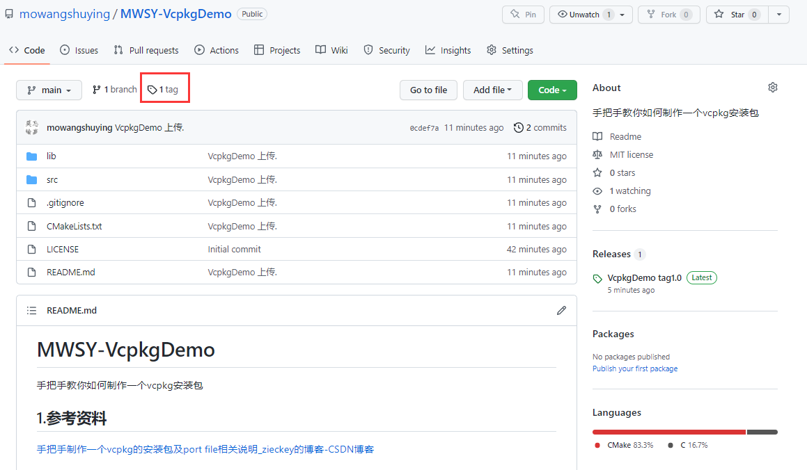
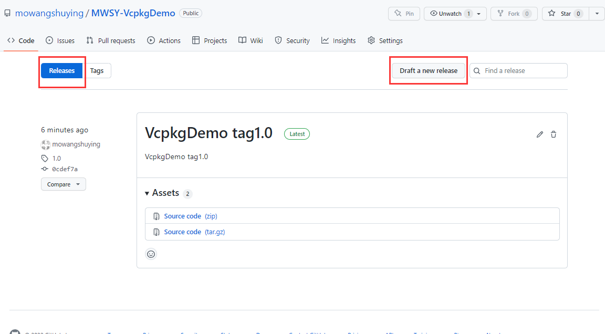
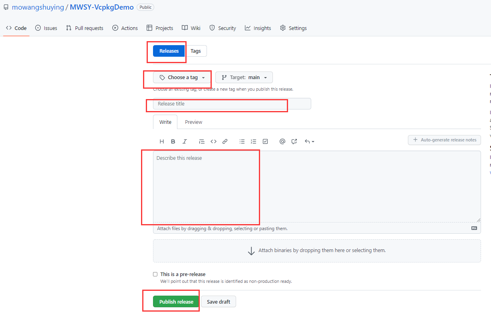
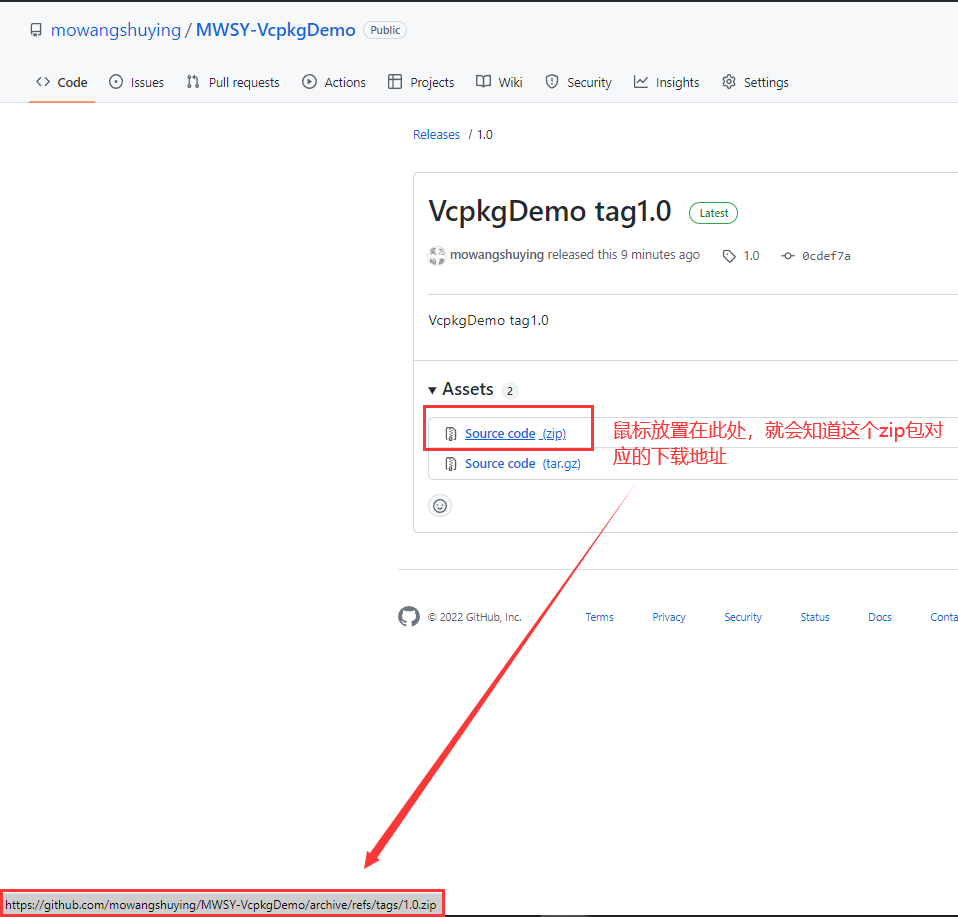
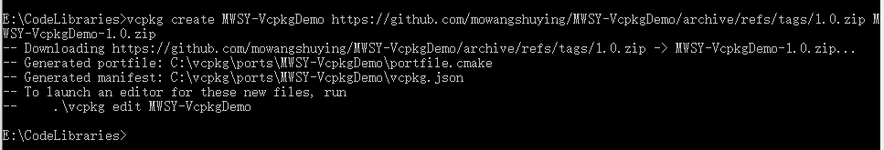

# MWSY-VcpkgDemo

手把手教你如何制作一个vcpkg安装包

## 1.参考资料

[手把手制作一个vcpkg的安装包及port file相关说明_zieckey的博客-CSDN博客](https://blog.csdn.net/zieckey/article/details/72795427)

## 2.代码

### 2.1目录结构

>MWSY-VcpkgDemo
>├─lib
>└─src

### 2.2 内容

#### hello.h、hello.c

此函数声明在hello.h文件中，函数的实现在hello.c文件中，hello.c中的内容如下：

```c++
#include <stdio.h>
void HelloFunc()
{
    printf("Hello World from t4 %s\n", __FUNCTION__);
}
```

#### main.c

main.c文件中主要是调用hello.h中的函数HelloFunc函数

```c++
//main.c
#include "hello.h"
int main()
{
    HelloFunc();
    return 0;
}

```

### 2.3 CMakeLists.txt

项目中共有3个CMakeLists.txt文件，分别位于项目目录、项目目录/lib、项目目录/src下

#### 项目目录下的CMakeLists.txt

```cmake
# 设置cmake最低版本号
cmake_minimum_required(VERSION 3.8)
# 设置项目名
project (MWSY-VcpkgDemo)
# 打印二进制目录
message(STATUS "This is BINARY dir " ${CMAKE_BINARY_DIR})
# 打印源文件目录
message(STATUS "This is SOURCE dir " ${CMAKE_SOURCE_DIR})
# 添加子目录 lib
add_subdirectory(lib)
# 添加子目录 bin
add_subdirectory(src bin)

# 包的信息
# 设置包的版本号
set (CPACK_PACKAGE_VERSION_MAJOR    1)
set (CPACK_PACKAGE_VERSION_MINOR    2)
set (CPACK_PACKAGE_VERSION_PATCH    3)

set (CPACK_PACKAGE_CONTACT          "zieckey@gmail.com")
set (CPACK_GENERATOR                "TGZ")
set (CPACK_PACKAGING_INSTALL_PREFIX "/home/weizili/hello")

# 要使用打包功能，需要执行include(CPack)启用相关的功能
include (CPack)
```

#### 项目目录/lib下的CMakeLists.txt

```
add_library(hello_static STATIC hello.c)
set_target_properties(hello_static PROPERTIES OUTPUT_NAME "hello")

install (TARGETS hello_static
  RUNTIME DESTINATION bin
  LIBRARY DESTINATION lib
  ARCHIVE DESTINATION lib)

install (FILES hello.h DESTINATION "include")
```

#### 项目目录/src下的CMakeLists.txt

```
include_directories(${CMAKE_SOURCE_DIR}/lib)
add_executable(main main.c)
target_link_libraries(main hello_static)
```

## 3 tag

### 3.1 创建tag







### 3.2 对应的zip包的下载地址



## 4.mwsy-vcpkgdemo

### 4.1 创建mwsy-vcpkgdemo包

```shell
vcpkg create mwsy-vcpkgdemo https://github.com/mowangshuying/MWSY-VcpkgDemo/archive/refs/tags/1.0.zip mwsy-vcpkgdemo-1.0.zip
```



### 4.2 安装mwsy-vcpkgdemo包

#### 前置工作，修改vcpkg.json,

```json
{
    "name": "mwsy-vcpkgdemo",
    "version-string": "1.0",
    "homepage": "",
    "description": "mwsy-vcpkgdemo.",
    "dependencies": [{
        "name": "vcpkg-cmake",
        "host": true
    }]
}
```


### 4.3 使用mwsy-vcpkgdemo包

```shell
vcpkg install mwsy-vcpkgdemo
```

### 4.4 vs2019中使用mwsy-vcpkgdemo包

引入相应头文件即可直接使用其中的相关函数，HelloFunc（）